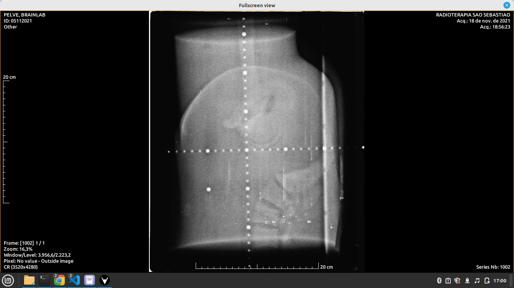
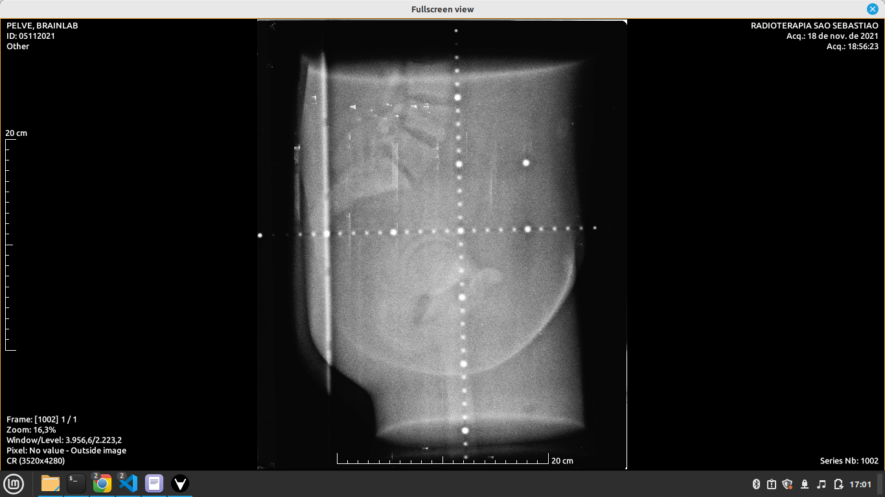
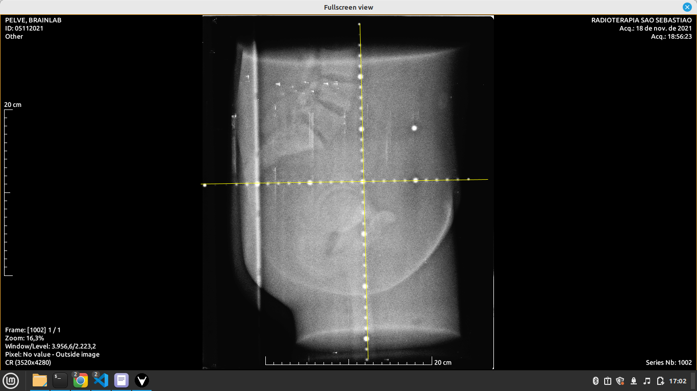

# Desafio de Programação para Estágio

## Objetivo

Seu objetivo é criar um Dockerfile para rodar uma aplicação Node.js com React que renderizará uma imagem DICOM.

## Requisitos

### Docker

1. Crie um Dockerfile para uma aplicação Node.js.
2. A aplicação deverá ser servida na porta 3000 do contêiner.

### Aplicação React

1. A aplicação deverá ser criada usando React.
2. Deve usar a biblioteca Cornerstone.js para renderizar uma imagem DICOM.

### Imagem DICOM

1. A imagem DICOM será fornecida por um serviço Python rodando em um contêiner Docker na porta 9999.
2. Sua aplicação React deve ser capaz de solicitar e receber esta imagem DICOM.

### Crosshair de Régua

1. Rotacione a imagem 

2. Implemente um recurso de crosshair em régua na imagem renderizada.

2. O crosshair de régua deve mostrar distâncias de 5 em 5 cm na imagem, ela ficará em cima dos pontos que já existem na imagem.

## Referências

Para mais informações sobre a instalação e uso do Cornerstone.js, consulte os seguintes links:

- [Instalação do Cornerstone.js](https://www.cornerstonejs.org/docs/getting-started/installation)
- [Como criar um carregador de imagem personalizado](https://www.cornerstonejs.org/docs/how-to-guides/custom-image-loader)

Exemplos ao vivo podem ser encontrados aqui:

- [Exemplo básico de carregamento de imagem](https://www.cornerstonejs.org/live-examples/stackbasic)
- [Exemplo de manipulação de imagem](https://www.cornerstonejs.org/live-examples/labelmaprendering)
- [Exemplo de troca de mapa de etiquetas](https://www.cornerstonejs.org/live-examples/labelmapswapping)

## Avaliação

Você será avaliado pela correta implementação dos requisitos acima, bem como pela organização e estrutura do seu código.
